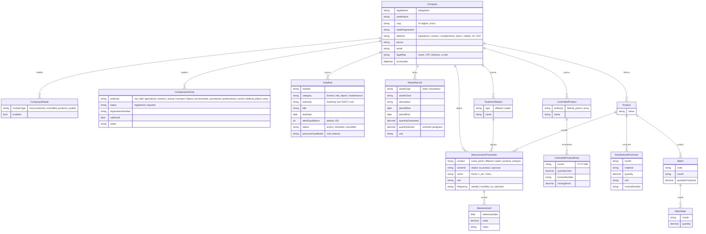

# 03 — Domínio

## Glossário

Nomes em código propostos em inglês — **a confirmar** (ver perguntas em aberto).

| Termo (cliente) | Significado | Nome em código |
|---|---|---|
| Empresa | Indústria atendida | `Company` |
| Módulo | Área regulatória habilitável por empresa | `ModuleType` |
| Licença | Autorização com validade emitida por órgão | `Deadline` (categoria `license`) |
| Prazo / vencimento | Qualquer data que exige ação e alerta | `Deadline` |
| Alerta | Aviso antes do vencimento | `Reminder` |
| Automonitoramento | Medições que a empresa é obrigada a fazer | — (agrupador) |
| Ponto de medição | Local fixo onde se mede ruído | `NoisePoint` |
| R.S. — resíduos sólidos | Resíduos classificados por classe | `WasteRecord` (tipo `solid`) |
| R.P. — resíduos perigosos | Resíduos perigosos gerados/armazenados | `WasteRecord` (tipo `hazardous`) |
| ETE | Estação de Tratamento de Efluentes | `TreatmentStation` (tipo `effluent`) |
| ETA | Estação de Tratamento de Água | `TreatmentStation` (tipo `water`) |
| Laudo | Análise técnica com data/resultado (não confundir com relatório exportado) | `Deadline` (datas) / `AnalysisResult` (valores) |
| Produto controlado | Produto químico fiscalizado por PF ou Exército | `ControlledProduct` |
| Órgão | Prefeitura, MAPA, ANVISA, SEMACE, IBAMA, Secretaria de Meio Ambiente, Conselho de Classe, PF, Exército (lista fixa) | `Authority` |
| Registro no órgão | Situação da empresa perante um órgão: possui registro ou precisa obter, com nº e validade | `AuthorityRegistration` |
| Responsável legal | Pessoa que responde legalmente pela empresa | `LegalRepresentative` |
| Razão social / nome fantasia | Nome jurídico / nome comercial | `legalName` / `tradeName` |
| Inscrição estadual | Registro na Sefaz estadual | `stateRegistration` |
| Nota fiscal | Documento fiscal da compra/uso | `invoiceNumber` |
| Lote | Unidade de produção rastreável | `Batch` |
| Matéria-prima | Insumo comprado para produção | `RawMaterialPurchase` |
| Relatório | Arquivo exportado (xlsx/docx) para o órgão | `ExportReport` |

## Decisão de modelagem

Os módulos têm campos diferentes e a cliente disse que "pode incluir mais coisas". Duas abordagens foram consideradas:

1. **Tabelas específicas** por tipo de registro — tipagem forte, relatórios simples, mas cada novo tipo exige migração.
2. **Registros genéricos configuráveis** (tipo de lançamento + campos dinâmicos) — flexível, mas complexo de validar e de exportar.

**Proposta: híbrido começando pelo simples.** Entidades centrais tipadas (empresa, prazo, produto, lote). Para medições, uma estrutura semi-genérica de *parâmetro + valor* (`MeasurementParameter` / `Measurement`), que cobre ruído, ETE/ETA e laudos de análise sem uma tabela para cada caso. Reavaliar após a Fase 2.

## Modelo preliminar

Campos de controle omitidos no diagrama, mas presentes em todas as tabelas: `id` (UUID), `createdAt`, `updatedAt`, `deletedAt`.

### Regras de negócio já identificadas

- **Estoque por lote** = `quantityProduced` − soma de `BatchSale.quantity`. É **calculado**, não digitado.
- **Consolidação anual** de um produto = soma dos lotes produzidos no ano, soma das vendas no ano e soma dos saldos em aberto.
- **Órgãos e módulos** são enums fixos no código, guardados por um código estável em texto ([D007](decisoes.md#d007--órgãos-e-módulos-como-enums-de-domínio)). Órgão sem registro na empresa = "não se aplica".
- **Registro vencido** (`validUntil` anterior a hoje) é derivado, não persistido.
- **Situação de um prazo** é derivada de `dueDate` e `alertDaysBefore` em relação à data atual: *vigente* → *a vencer* (dentro da janela de alerta) → *vencido*.
- **Renovar** cria um novo `Deadline` apontando para o anterior e marca o anterior como `renewed`.
- **Produtos controlados:** o estoque ao fim do mês é informado pela cliente, não calculado. **(?)** confirmar se deveria ser calculado a partir do estoque anterior e das entradas/saídas.
