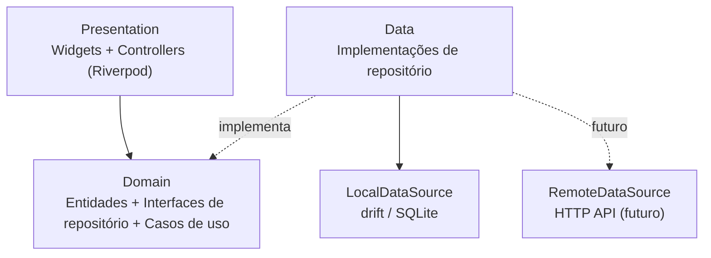

# 04 — Arquitetura

## Objetivos

1. Começar simples: app Android, offline, banco local.
2. Trocar o banco local por uma API **sem reescrever telas nem regras de negócio**.
3. Manter o código organizado por funcionalidade, para crescer módulo a módulo.

## Camadas



- **Domain** é Dart puro: não importa Flutter, drift nem HTTP. Define as entidades e os contratos (`abstract interface class CompanyRepository`).
- **Data** implementa os contratos. Na fase 1 existe apenas `LocalCompanyRepository`, que converte linhas do drift para entidades do domínio.
- **Presentation** conhece só o domínio. Os repositórios chegam via providers do Riverpod.

A troca para API acontece em **um ponto**: o provider que decide qual implementação de repositório injetar. Em seguida é possível evoluir para um repositório *offline-first* que grava local e sincroniza com a API.

## Preparação para a API desde já

| Prática | Motivo |
|---|---|
| IDs UUID gerados no app | Registros criados offline não colidem com IDs do servidor |
| `createdAt`, `updatedAt` em todas as tabelas | Base para sincronização incremental |
| Exclusão lógica (`deletedAt`) | Exclusões também precisam ser sincronizadas |
| Entidades de domínio separadas das linhas do banco | O formato do banco e o JSON da API podem mudar sem afetar a UI |
| Repositórios retornam `Future`/`Stream` | A mesma assinatura serve para banco local e rede |
| Erros mapeados para tipos do domínio | A UI não trata `SqliteException` nem `DioException` diretamente |

## Stack proposta

| Necessidade | Pacote | Observação |
|---|---|---|
| Banco local | `drift` (SQLite) | Tipado, migrações versionadas, queries reativas (`watch`) |
| Estado e injeção | `flutter_riverpod` | Troca de implementação via override de provider |
| Navegação | `go_router` | |
| IDs | `uuid` | |
| Modelos imutáveis | `freezed` (opcional) | Avaliar se o ganho compensa o code generation |
| Notificações | `flutter_local_notifications` | Agendamento local dos alertas |
| Planilha | `excel` | Geração de `.xlsx` |
| Word | a validar (`docx_template` ou similar) | Preenche um `.docx` modelo; precisa de prova de conceito |
| Compartilhar arquivo | `share_plus` | |
| Backup/restauração | `path_provider` + `file_picker` | Exportar/importar o arquivo do banco |

Versões serão fixadas no `pubspec.yaml` na Fase 0.

## Estrutura de pastas

Organização *feature-first*:

```
lib/
├── main.dart
├── app/                      # MaterialApp, rotas, tema
├── core/
│   ├── database/             # AppDatabase (drift), migrações
│   ├── notifications/        # agendamento de alertas
│   ├── export/               # geração xlsx/docx
│   ├── errors/
│   └── utils/                # datas, formatação pt-BR
└── features/
    ├── companies/
    │   ├── domain/           # Company, CompanyRepository
    │   ├── data/             # tables, LocalCompanyRepository, mappers
    │   └── presentation/     # telas, controllers
    ├── deadlines/
    ├── environmental/
    ├── controlled_products/
    └── quality_control/
test/
    └── (mesma estrutura de lib/)
```

## Alertas (fase offline)

Sem backend, não há envio de e-mail. Os alertas serão **notificações locais**:

- Ao criar ou editar um prazo, o app agenda notificações para a data `dueDate − alertDaysBefore` e para lembretes seguintes (frequência a definir).
- Ao abrir o app, os agendamentos são recalculados. Isso cobre reinstalação, troca de fuso e notificações perdidas.
- A tela inicial sempre mostra os prazos "a vencer" e "vencidos". Ela não depende da notificação ter chegado.
- Android 13+ exige a permissão `POST_NOTIFICATIONS`. Como os alertas são por dia (e não por minuto), agendamento **inexato** basta, o que evita a permissão de alarme exato.

O envio de e-mail entra junto com a API, e o servidor passa a ser responsável por ele.

## Riscos

- **Perda de dados:** o banco vive só no aparelho. Mitigação: backup manual (RNF-04) desde cedo e lembrete periódico de backup.
- **Relatórios Word:** gerar `.docx` fiel a um modelo no Flutter é o ponto técnico mais incerto. Mitigação: prova de conceito antes da Fase 3.
- **Mudança de escopo por módulo:** a cliente prevê novos itens. Mitigação: a estrutura de parâmetros/medições descrita no [domínio](03-dominio.md).
